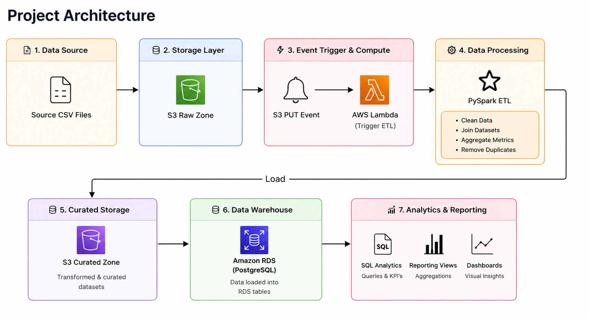

# Warehouse Network Carrier Performance Analytics Platform

## Project Structure

```text
warehouse-network-carrier-performance-analytics-platform/
├── README.md
├── documentation/
│   └── Project_Documentation.docx
├── architecture/
│   └── architecture_diagram.png
├── datasets/
│   ├── raw/
│   └── sample/
├── sql/
│   ├── schema/
│           └── create_database.py
│           └── create_schema.py
│           └── db_connection.py
│   └── analysis_queries/
├── pyspark/
│   ├── extraction/
│   ├── transformation/
│   └── loading/
├── screenshots/
├── testing/
│   └── test_cases.xlsx
└── visualizations/
```

## Architecture

```text
Source CSV Files
       ↓
Amazon S3 (Raw Zone)
       ↓
S3 PUT Event
       ↓
AWS Lambda
       ↓
PySpark ETL
(Clean / Join / Aggregate)
       ↓
Amazon Redshift
(Data Warehouse)
       ↓
SQL Analytics
       ↓
Matplotlib / Seaborn / Streamlit
```


## Architecture Diagram

<p align="center">
  
</p>